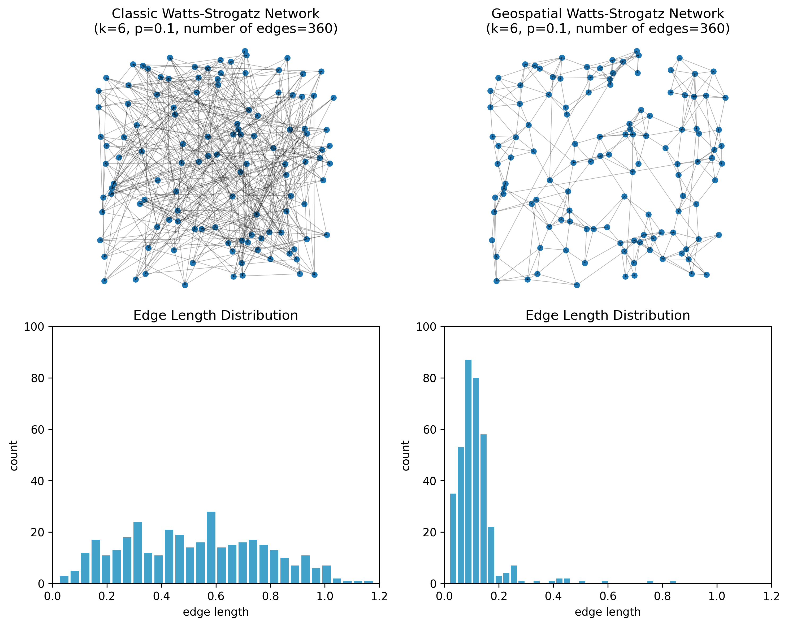

# Summary

Synthetic networks are commonly used to study the structure and dynamics of social systems, transportation infrastructure and other complex phenomena. Classical random graph models, such as the Erdős-Rényi, Watts-Strogatz and Barabási-Albert models, generate abstract networks with different structural characteristics: the Erdős-Rényi model connects nodes at random with equal probability, the Watts-Strogatz model rewires a ring lattice to produce small‑world networks, and the Barabási-Albert model yields scale‑free networks through preferential attachment [@erdos1960evolution; @watts1998collective; @barabasi1999emergence]. In their standard form these models ignore the spatial positions of nodes; yet in many empirical settings (e.g., human social networks, commuting patterns or infrastructure networks) proximity strongly influences who connects to whom.

PySGN (**Py**thon for **S**ynthetic **G**eospatial **N**etworks) is an open‑source Python package that extends the classical models to geospatial contexts. It embeds nodes in geographic coordinate space, modifies connection rules to decay with distance, and allows users to incorporate clustering and preferential attachment while respecting spatial constraints. By combining these ingredients, PySGN generates synthetic geosocial networks that mimic the spatial relationships observed in real‑world networks. The package integrates with the PyData ecosystem through libraries like GeoPandas [@joris_van_den_bossche_2024_12625316] and NetworkX [@osti_960616] and provides a flexible interface for research and simulation.

With PySGN, users can specify parameters such as average degree and decay function among other options, and construct a geospatially embedded network as NetworkX graph objects. They can also fine‑tune the generation process by defining custom distance functions or constraints. The resulting networks can be further analyzed and visualized thereafter. The package is intended for researchers and practitioners in fields such as urban planning, epidemiology, infrastructure resilience and social science who require robust tools for simulating and analyzing complex geospatial networks.

# Statement of Need

The need for synthetic geospatial networks arises from their utility in social simulations, including modeling of transportation systems, pedestrian movements, and the spread of infectious diseases [@zufle2024silico]. Traditional synthetic populations often lack the integration of geographic social networks, which are crucial for accurately capturing social connections and spatial dynamics, to explore the effects of spatial proximity on social interactions, mobility patterns, and network robustness [@jiang2024large].

PySGN addresses this gap by providing a tool that not only generates geographically explicit networks but also incorporates key network properties, such as clustering, preferential attachment and spatial decay. These features allow users to explore different network properties and configurations (e.g., average node degree). This is essential for a variety of simulation scenarios, where understanding spatial relationships and social dynamics is critical for analyzing and modeling complex systems. This makes PySGN suitable for diverse applications, including infrastructure resilience studies, agent-based modeling, and geospatial data analysis.

## Related Work

There are some Python packages that work with spatial networks but their focus is primarily on processing or downloading real‐world street data rather than generating new networks. For example, `neatnet` simplifies complex street geometries - such as dual carriageways and roundabouts - so that analysts can work with cleaner, more interpretable road layouts [@FLEISCHMANN2026102354]. OSMnx provides tools to download, analyze and visualize street networks and other features from OpenStreetMap with a single command [@boeing2025osmnx]. Both of these libraries operate on existing network data, however, neither offers a way to create synthetic networks or adjust the underlying spatial distribution of nodes.

Within the PySAL ecosystem, `spaghetti` is an open-source library for analyzing network-based spatial data. It originated from PySAL's network module and provides tools to build network objects from line geometries and to analyze network-constrained events along those networks [@Gaboardi2021]. In parallel, PySAL has introduced `libpysal.graph`, an experimental representation for spatial weights matrices (intended for spatial-statistical workflows rather than network-event analysis) [@pysal2007]. These tools support analysis and representation of existing spatial relationships and networks, but they do not provide generative models for synthetic geospatial network construction, which is the focus of PySGN.

General‑purpose network libraries such as NetworkX and `igraph` include random graph generators. NetworkX offers functions to generate Erdős-Rényi, Watts-Strogatz and Barabási-Albert graphs [@osti_960616], and `igraph` includes similar random graph models (Barabási-Albert, Erdős-Rényi, Watts-Strogatz and other stochastic graph models) [@csardi2006igraph]. However, these models do not incorporate geographic information or spatial distances: nodes are considered abstract or are uniformly distributed, and edge probabilities do not depend on spatial proximity. Consequently, while NetworkX and igraph are excellent tools for general network analysis and for generating abstract random graphs, they are unsuitable for constructing geospatial networks where spatial proximity influences connectivity [@10.1145/3615896.3628345].

By contrast, PySGN synthesizes geospatial networks by embedding nodes in geographic coordinate space and incorporating distance‑decay functions and other constraints into the generation process. It extends the classical random graph models (Erdős-Rényi, Watts-Strogatz and Barabási-Albert) to spatial contexts and integrates with GeoPandas and NetworkX to provide geospatially explicit network generation and analysis. Thus, PySGN fills a gap between packages that simplify or analyze existing spatial networks and those that generate abstract random graphs.

## Example

To illustrate how spatial constraints alter both the structure of a network and the distribution of connection distances, Figure 1 contrasts a **geospatial Watts-Strogatz network** with its **classic Watts-Strogatz** counterpart. In this demonstration we placed 120 nodes uniformly at random in a unit square. For the spatial model we used the `geo_watts_strogatz_network()` function provided by PySGN with parameters `k=6` and `p=0.1`. This model first connects each node to its six nearest neighbours and then rewires edges according to a distance‑dependent rule: existing edges are rewired with probability *p*, but new targets are chosen with a probability that decays exponentially with Euclidean distance. Nearby nodes are therefore much more likely to be connected than distant nodes. For comparison we generated a classic Watts-Strogatz network with the same values of *n*, *k* and *p* using NetworkX's `watts_strogatz_graph()`. In the classic formulation, rewired edges connect to a **uniformly random node**, which ignores the geometry of the embedding and often results in long edges that criss‑cross the domain.

The top row of Figure 1 shows the resulting networks. The geospatial Watts-Strogatz network (right) features mostly short edges and tightly clustered neighbourhoods, whereas the classic network (left) includes many long‑range shortcuts, producing a tangled appearance. The bottom row plots histograms of the Euclidean lengths of all edges. Because edges in the classic model are rewired without regard to distance, the lengths span the full range of possible distances between random points in the unit square; by contrast, the geospatial model's distance‑decay function leads to a sharp peak at short distances and very few long edges. Together, these panels demonstrate how incorporating geography into a Watts-Strogatz model yields networks that better reflect the localised interactions observed in real‑world systems. For more elaborate examples based on empirical geospatial networks, see Züfle et al. [@zufle2024silico] or Gastner and Newman [@Gastner2006].

<!-- import geopandas as gpd
import matplotlib.pyplot as plt
import networkx as nx
import numpy as np
from shapely.geometry import Point

from pysgn import (
    geo_barabasi_albert_network,
    geo_erdos_renyi_network,
    geo_watts_strogatz_network,
)

def make_points_gdf(n=120, seed=7):
    rng = np.random.default_rng(seed)
    pts = rng.random((n, 2))  # unit square
    gdf = gpd.GeoDataFrame(
        {"node": np.arange(n)},
        geometry=[Point(float(x), float(y)) for x, y in pts],
        crs="EPSG:3857",
    )
    return gdf, pts

def edge_lengths(edges, pts):
    if len(edges) == 0:
        return np.array([])
    e = np.asarray(edges, dtype=int)
    u, v = e[:, 0], e[:, 1]
    return np.sqrt(((pts[u] - pts[v]) ** 2).sum(axis=1))

def plot_spatial(ax, edges, pts, title):
    ax.set_title(title)
    ax.set_aspect("equal", adjustable="box")

    edges_draw = list(edges)

    for u, v in edges_draw:
        x1, y1 = pts[u]
        x2, y2 = pts[v]
        ax.plot([x1, x2], [y1, y2], linewidth=0.5, c="k", alpha=0.3)

    ax.scatter(pts[:, 0], pts[:, 1], s=20)
    ax.axis("off")

def plot_hist(ax, lengths, title):
    ax.set_title(title)
    ax.set_xlabel("edge length")
    ax.set_ylabel("count")
    if len(lengths) == 0:
        ax.text(0.5, 0.5, "No edges", ha="center", va="center")
        return
    ax.hist(lengths, bins=30, rwidth=0.8, color="#43a2ca")
    ax.set_xlim([0, 1.2])
    ax.set_ylim([0, 100])

gdf, pts = make_points_gdf(n=120, seed=7)

k, p = 6, 0.1

G_ws_classic = nx.watts_strogatz_graph(len(pts), k, p, seed=7)
ws_classic_edges = list(G_ws_classic.edges())
ws_len_classic = edge_lengths(ws_classic_edges, pts)

G_ws_geo = geo_watts_strogatz_network(gdf, k=k, p=p)
ws_geo_edges = list(G_ws_geo.edges())
ws_len_geo = edge_lengths(ws_geo_edges, pts)

fig, axs = plt.subplots(2, 2, figsize=(10, 8))
plot_spatial(
    axs[0, 0],
    ws_classic_edges,
    pts,
    f"Classic Watts-Strogatz Network\n(k={k}, p={p}, number of edges={len(ws_classic_edges)})",
)
plot_spatial(
    axs[0, 1],
    ws_geo_edges,
    pts,
    f"Geospatial Watts-Strogatz Network\n(k={k}, p={p}, number of edges={len(ws_geo_edges)})",
)
plot_hist(axs[1, 0], ws_len_classic, "Edge Length Distribution")
plot_hist(axs[1, 1], ws_len_geo, "Edge Length Distribution")
fig.tight_layout()
fig.savefig("example.png", dpi=300, bbox_inches="tight") -->

# Acknowledgements

The algorithms implemented in PySGN are based on the work of @alizadeh2017generating and @10.1145/3615896.3628345, with several improvements and modifications, including bug fixes, performance enhancements, and additional features. We would like to thank the authors for their contributions to the field of synthetic geospatial network generation.

This work was supported by the Intelligence Advanced Research Projects Activity (IARPA) via Department of Interior/Interior Business Center (DOI/IBC) contract number 140D0423C0025. The U.S. Government is authorized to reproduce and distribute reprints for Governmental purposes notwithstanding any copyright annotation thereon. Disclaimer: The views and conclusions contained herein are those of the authors and should not be interpreted as necessarily representing the official policies or endorsements, either expressed or implied, of IARPA, DOI/IBC, or the U.S. Government.

# References